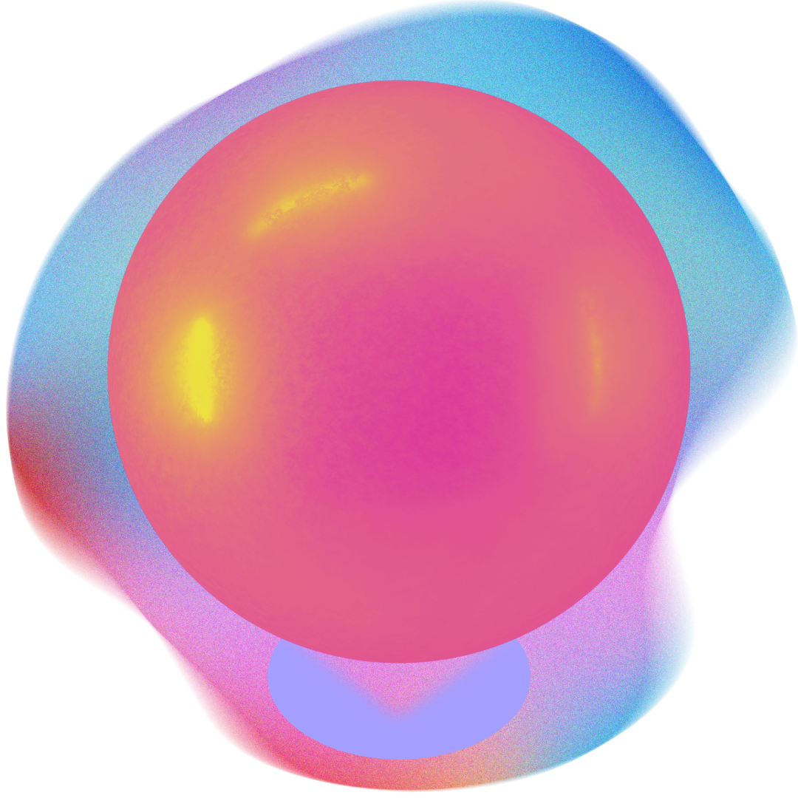

# Mercurial UI
<p align="center">
  
</p>
Mercurial UI is a web application built with Nextjs (React), TypeScript. It provides a user-friendly interface for managing tasks, subjects, and topics, with features such as authentication, dashboards, and user profile management.

You can visit the app deployment at (https://mercurial-app.vercel.app)

**Author:** [Crisdev](https://crisdev-pi.vercel.app)

## Features

- User authentication (sign up, login, password recovery, account verification)
- Dashboard for managing tasks (create, edit, delete, mark as done/undone)
- Subject and topic management (create, edit, delete)
- Responsive UI with Material-UI and custom CSS
- Integration with a RESTful backend API
- User profile and settings management
- Offline capabilities an features

## Project Structure

```
.
├── app/                # Next.js app directory (pages, layouts, routes)
├── components/         # Reusable React components (forms, dialogs, etc.)
├── hooks/              # Custom React hooks
├── lib/                # Utility libraries
├── public/             # Static assets
├── store/              # State management (e.g., Zustand stores)
├── ui/                 # UI components (forms, widgets)
├── utils/              # Utility functions (API calls, helpers)
├── package.json        # Project dependencies and scripts
├── tsconfig.json       # TypeScript configuration
├── README.md           # Project documentation
```

## Getting Started

### Prerequisites

- Node.js (v16+ recommended)
- npm or yarn

### Installation

1. Clone the repository:
   ```sh
   git clone https://github.com/your-username/mercurial_ui.git
   cd mercurial_ui
   ```

2. Install dependencies:
   ```sh
   npm install
   # or
   yarn install
   ```

3. Set up environment variables:
   - Copy `.env.example` to `.env` and fill in the required values.

### Running the Development Server

```sh
npm run dev
# or
yarn dev
```

The app will be available at [http://localhost:3000](http://localhost:3000).

### Building for Production

```sh
npm run build
npm run start
```

## API

The app communicates with a RESTful API. This API us developed using ASP.NET Core 9, you can find the reposotory for this project at (https://github.com/CrisD314159/Mercurial_Dotnet) 

## Technologies Used

- [React](https://react.dev/)
- [Next.js](https://nextjs.org/)
- [TypeScript](https://www.typescriptlang.org/)
- [Material-UI](https://mui.com/)
- [Zustand](https://zustand-demo.pmnd.rs/) (for state management)
- [Tailwind CSS](https://tailwindcss.com/)
- [Dexie.js](https://dexie.org) (For offline features)

